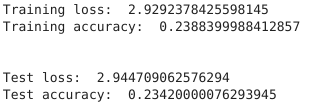
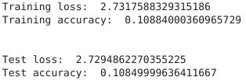
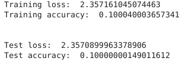
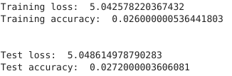
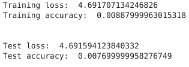

# CNN Image Recognition

The two notebooks were created using the notebooks available at [Rock Paper Scissors (using Convolutional Neural Network)](https://github.com/trekhleb/machine-learning-experiments/blob/master/experiments/rock_paper_scissors_cnn/rock_paper_scissors_cnn.ipynb) and [Image Classification (MobileNetV2, ImageNet)](https://github.com/trekhleb/machine-learning-experiments/blob/master/experiments/image_classification_mobilenet_v2/image_classification_mobilenet_v2.ipynb) and [Rock Paper Scissors (using MobileNetV2 network)](https://github.com/trekhleb/machine-learning-experiments/blob/master/experiments/rock_paper_scissors_mobilenet_v2/rock_paper_scissors_mobilenet_v2.ipynb).

This repository contains a [Jupyter](https://jupyter.org/) Notebook for the training of a [Convolutional Neural Network model](https://www.tensorflow.org/tutorials/images/cnn) and [MobileNet V2 & V3 Small & V3 Large](https://www.tensorflow.org/api_docs/python/tf/keras/applications) for classifying images.

### Libraries

- [TensorFlow](https://www.tensorflow.org/) — Creating and training model
- [Matplotlib Pyplot](https://matplotlib.org/stable/) — Visualising results
- [Numpy](https://numpy.org/) — Processing data
- [Pandas](https://pandas.pydata.org/) — Loading data

### Data

The first data set used in the CNN Rock Paper Scissors notebook is the [TensorFlow Rock Paper Scissors](https://www.tensorflow.org/datasets/catalog/rock_paper_scissors) data set. Each image is 300 by 300 pixel RGB images. The training set contains 2,520 images and the testing set contains 372 images.

The second notebook uses the CIFAR 10 and CIFAR 100 which is originally available from [CS Toronto](https://www.cs.toronto.edu/~kriz/cifar.html). The 10 version has 60,000 32 by 32 colour images in 10 classes, and the 100 version has 100 classes with 600 images in each.

### Process

The procedure in the Jupyter Notebook ([Ipynb](Notebooks/cnn_r_p_s.ipynb), [PDF](Notebooks/cnn_r_p_s.pdf)) for the Rock Paper Scissors is quite similar to the original notebook.

The following procedure is used in the MobileNet Jupyter Notebook ([Ipynb](Notebooks/mobilenet_cifar.ipynb), [PDF](Notebooks/mobilenet_cifar.pdf)) to process and visualise the data:

1. First the data set is loaded in from the TensorFlow data sets. This can be the CIFAR 10 or CIFAR 100.
2. The data is then visualised and normalised for the model, from 0 to 255 to 0 to 1.
3. The images are then shuffled and batched.
4. Next the model is loaded in. This can be the MobileNet V2, MobileNet V3 Small or MobileNet V3 Large.
5. The model is set to be not trainable as only a small selection of it needs to be modified for the data.
6. 2 layers for the end of the model are added on to specify the classes for the model.
7. The model is compiled together and trained on the data, the output of the training is shown.
8. To increase the accuracy of the model it is further fine tuned by unfreezing the top layers and train them specifically for this data.
9. The results of the training and fine tuning are shown in a graph and the model is evaluated, and saved.
10. The result are shown below.

   _Evaluation for CIFAR 10 MobileNet V2:_  
   

   _Evaluation for CIFAR 10 MobileNet V3 Large:_  
   

   _Evaluation for CIFAR 10 MobileNet V3 Small:_  
   

   _Evaluation for CIFAR 100 MobileNet V2:_  
   

   _Evaluation for CIFAR 100 MobileNet V3 Large:_  
   

   _Evaluation for CIFAR 100 MobileNet V3 Small:_  
   

### Problems

As seen above none of the models had turned out great using the data set from the CIFAR data. This could be due as the CIFAR data set contains images of only 32 by 32 pixels, however MobileNet models are best performing when using higher resolution images, as a result the models could have performed poorly because of the lack of information for them.
